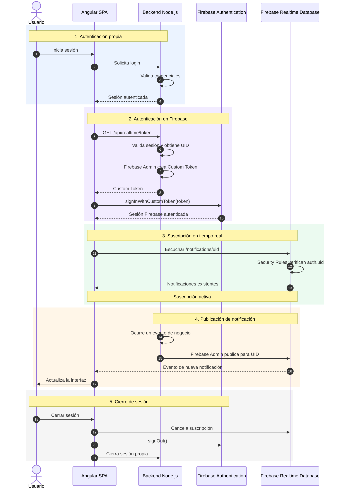

```mermaid
sequenceDiagram
    autonumber

    actor U as Usuario
    participant A as Angular SPA
    participant B as Backend Node.js
    participant FA as Firebase Authentication
    participant DB as Firebase Realtime Database

    rect rgb(235, 243, 255)
        Note over U,B: 1. Autenticación propia
        U->>A: Inicia sesión
        A->>B: Solicita login
        B->>B: Valida credenciales
        B-->>A: Sesión autenticada
    end

    rect rgb(242, 236, 255)
        Note over A,FA: 2. Autenticación en Firebase
        A->>B: GET /api/realtime/token
        B->>B: Valida sesión y obtiene UID
        B->>B: Firebase Admin crea Custom Token
        B-->>A: Custom Token
        A->>FA: signInWithCustomToken(token)
        FA-->>A: Sesión Firebase autenticada
    end

    rect rgb(235, 250, 240)
        Note over A,DB: 3. Suscripción en tiempo real
        A->>DB: Escuchar /notifications/uid
        DB->>DB: Security Rules verifican auth.uid
        DB-->>A: Notificaciones existentes
        Note over A,DB: Suscripción activa
    end

    rect rgb(255, 246, 232)
        Note over B,DB: 4. Publicación de notificación
        B->>B: Ocurre un evento de negocio
        B->>DB: Firebase Admin publica para UID
        DB-->>A: Evento de nueva notificación
        A->>U: Actualiza la interfaz
    end

    rect rgb(245, 245, 245)
        Note over U,FA: 5. Cierre de sesión
        U->>A: Cerrar sesión
        A->>DB: Cancela suscripción
        A->>FA: signOut()
        A->>B: Cierra sesión propia
    end
```